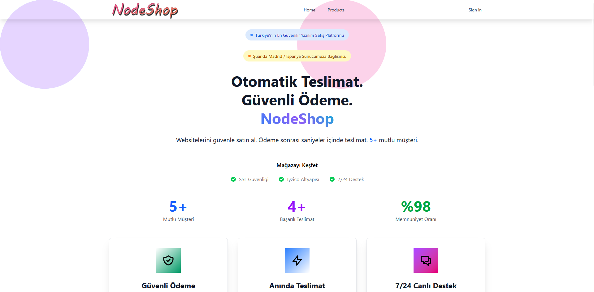
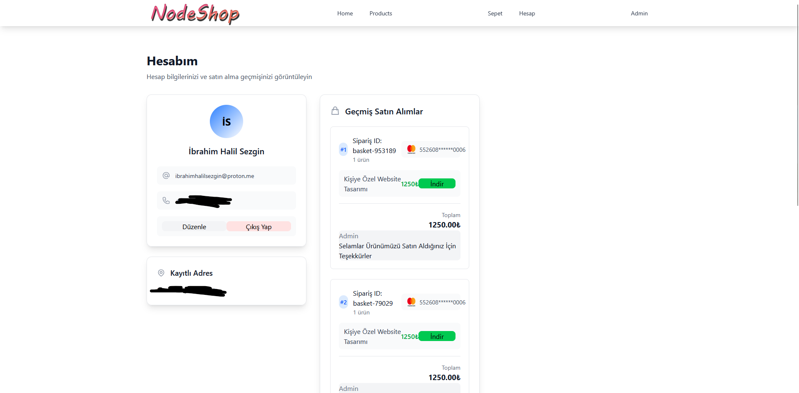
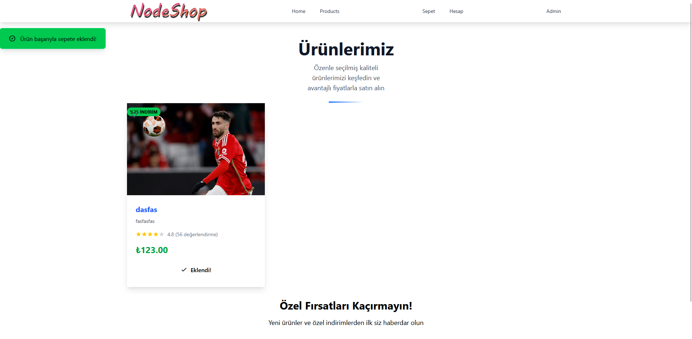
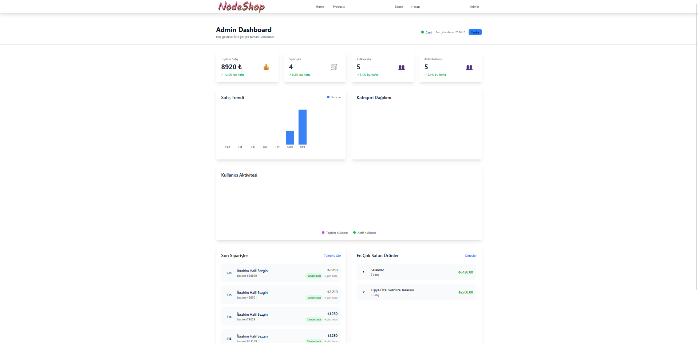
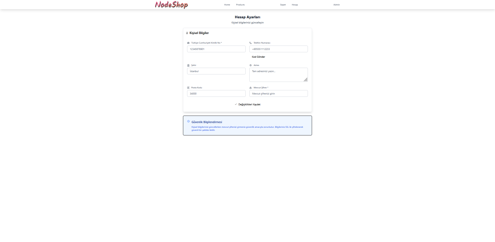

# 🛒 NODESHOP – E-Ticaret Sitesi

Can sıkıntısından geliştirdiğim ama oldukça keyif aldığım bir proje.

---

## ⚙️ Kullanılan Teknolojiler

- **Frontend**: Svelte, SvelteKit, Vite  
- **Backend**: Express.js  
- **Veritabanı**: MongoDB  

---

## 🖼️ Ekran Görüntüleri

|                                 |                                 |
|---------------------------------|---------------------------------|
|              |              |
|              |              |
|              |                                 |

---

## 🔧 # Kurulum ve Çalıştırma 

### Backend
.env dosyası doldurulduktan sonra:
> npm install  
> npm run dev
### frontend
.env dosyası doldurulduktan sonra:
> npm install  
> npm run build  
> npm run preview

### cdn
.env dosyası doldurulduktan sonra:
> npm install  
> npm run dev

# ⚠️ Uyarı / Dikkat Edilmesi Gerekenler

## Development Mode açık bırakılırsa sms gönderilmek yerine tarayıcı konsoluna yazdırılır